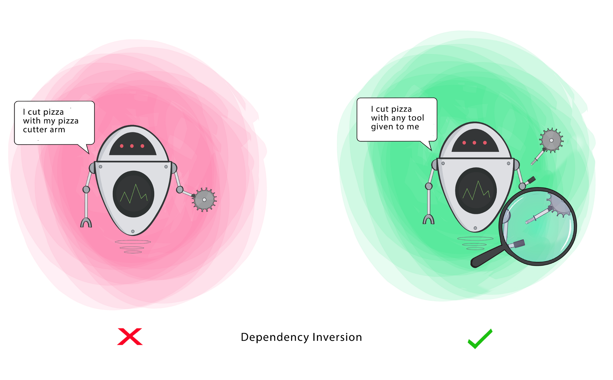

# The S.O.L.I.D Principles in Pictures

Written by **Ugonna Thelma** 

##### *All illustrations in this article are by Ugonna Thelma

If you are familiar with [Object-Oriented Programming](https://en.wikipedia.org/wiki/Object-oriented_programming), then you’ve probably heard about the [**SOLID**](https://en.wikipedia.org/wiki/SOLID) principles.

These five software development principles are guidelines to follow when building software so that it is easier to scale and maintain. They were made popular by a software engineer, Robert C. Martin.

There are so many great articles online about **SOLID** but I rarely see any examples with pictures. This makes it a bit difficult for visual learners like me to learn while staying engaged.

So the main aim of this article is to get a better understanding of these principles using illustrations and emphasizing the goal for each principle.

You see, some of these principles may look similar but they are not targeting **the same goal**. It is possible to satisfy one principle while violating the other, even though they are alike.

To make this as simple to follow, I will be using the word “**Class**” but note that it can also apply to a **Function**, **Method** or **Module** in this article.

**Update**

I got some comments about the Open Closed in this article violating the Single Responsibility Principle. Please note that the aim of this article is to explain each of these principles independent of the others.
Also, Responsibilities(or Roles) are different from Actions. 

In SRP, I used “I am Painter”, in Open-Closed, I used “I can Paint”.
It is important to note this because several actions can be performed to fulfil a responsibility(or role). The class should have one responsibility(SRP) but its functionality that fulfils that responsibility should be open to extend(OCP).

Now, let’s begin!

## The SOLID Principles

### S — Single Responsibility

> A class should have a single responsibility

If a Class has many responsibilities, it increases the possibility of bugs because making changes to one of its responsibilities, could affect the other ones without you knowing.

**Goal**

This principle aims to separate behaviours so that if bugs arise as a result of your change, it won’t affect other unrelated behaviours.

### O — Open-Closed

> Classes should be open for extension, but closed for modification

Changing the current behaviour of a Class will affect all the systems using that Class.
If you want the Class to perform more functions, the ideal approach is to add to the functions that already exist NOT change them.

**Goal**

This principle aims to extend a Class’s behaviour without changing the existing behaviour of that Class. This is to avoid causing bugs wherever the Class is being used.

### L — Liskov Substitution

> If S is a subtype of T, then objects of type T in a program may be replaced with objects of type S without altering any of the desirable properties of that program.

When a **child** Class cannot perform the same actions as its **parent** Class, this can cause bugs.

If you have a Class and create another Class from it, it becomes a **parent** and the new Class becomes a **child**. The **child** Class should be able to do everything the **parent** Class can do. This process is called **Inheritance**.

The **child** Class should be able to process the same requests and deliver the same result as the **parent** Class or it could deliver a result that is of the same type.

The picture shows that the **parent** Class delivers Coffee(it could be any type of coffee). It is acceptable for the **child** Class to deliver Cappucino because it is a specific type of Coffee, but it is NOT acceptable to deliver Water.

If the child Class doesn’t meet these requirements, it means the child Class is changed completely and violates this principle.

**Goal**

This principle aims to enforce consistency so that the parent Class or its child Class can be used in the same way without any errors.

### I — Interface Segregation

> Clients should not be forced to depend on methods that they do not use.

When a Class is required to perform actions that are not useful, it is wasteful and may produce unexpected bugs if the Class does not have the ability to perform those actions.

A Class should perform only actions that are needed to fulfil its role. Any other action should be removed completely or moved somewhere else if it might be used by another Class in the future.

**Goal**

This principle aims at splitting a set of actions into smaller sets so that a Class executes ONLY the set of actions it requires.

### D — Dependency Inversion

> - High-level modules should not depend on low-level modules. Both should depend on the abstraction.

> - Abstractions should not depend on details. Details should depend on abstractions.

Firstly, let’s define the terms used here more simply

**High-level Module(or Class)**: Class that executes an action with a tool.

**Low-level Module (or Class)**: The tool that is needed to execute the action

**Abstraction**: Represents an interface that connects the two Classes.

**Details**: How the tool works

This principle says a Class should not be fused with the tool it uses to execute an action. Rather, it should be fused to the interface that will allow the tool to connect to the Class.

It also says that both the Class and the interface should not know how the tool works. However, the tool needs to meet the specification of the interface.

**Goal**

This principle aims at reducing the dependency of a high-level Class on the low-level Class by introducing an interface.

## Summary
So far, we have discussed these five principles and highlighted their goals. They are to help you make your code easy to adjust, extend and test with little to no problems.

Thank you so much for reading. I hope you have a better idea about this topic and you had as much fun reading this as I did writing it.

If you have any questions or suggestions, leave a comment or reach out to me on Twitter [**@ugonna_t**](https://twitter.com/ugonna_t).
